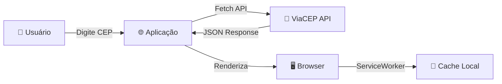

# 🗺️ Busca CEP - PWA

[](https://buscacep-joaopaulo.netlify.app)
[](LICENSE)
[](https://developer.mozilla.org/pt-BR/docs/Web/Guide/HTML/HTML5)
[](https://developer.mozilla.org/pt-BR/docs/Web/CSS)
[](https://developer.mozilla.org/pt-BR/docs/Web/JavaScript)
[](https://developer.mozilla.org/pt-BR/docs/Web/Progressive_web_apps)

**Busca CEP** é uma Progressive Web App (PWA) moderna e responsiva que permite consultar informações de endereços brasileiros através do número de CEP, utilizando a API ViaCEP. A aplicação funciona offline e é instalável em dispositivos móveis e desktops.

**[🚀 Acessar aplicação ao vivo](https://buscacep-joaopaulo.netlify.app)**

---

## 📋 Sumário

- [Sobre o Projeto](#-sobre-o-projeto)
- [Funcionalidades](#-funcionalidades)
- [Tecnologias](#-tecnologias)
- [Requisitos](#-requisitos)
- [Instalação Local](#-instalação-local)
- [Como Usar](#-como-usar)
- [Arquitetura](#-arquitetura)
- [PWA - Conceitos](#-pwa---conceitos)
- [Deploy](#-deploy)
- [Estrutura do Projeto](#-estrutura-do-projeto)
- [Troubleshooting](#-troubleshooting)
- [Contribuindo](#-contribuindo)
- [Autor](#-autor)
- [Licença](#-licença)

---

## 📖 Sobre o Projeto

### Visão Geral

O **Busca CEP** é uma aplicação web progressiva desenvolvida com tecnologias web modernas. Seu objetivo principal é oferecer uma experiência intuitiva e eficiente para consulta de informações de endereços brasileiros, combinando o melhor da web com recursos de aplicativos nativos.

### Objetivo

Evoluir uma aplicação web tradicional para uma **Progressive Web App (PWA)** completa, proporcionando:

- ✅ Instalação em dispositivos móveis e desktops
- ✅ Funcionamento offline ou com conexão instável
- ✅ Interface responsiva e intuitiva
- ✅ Acesso seguro via HTTPS
- ✅ Hospedagem pública e gratuita

### Caso de Uso

Ideal para:
- **Entregadores e logísticos**: Buscar endereços rapidamente
- **Cadastros online**: Preenchimento automático de formulários
- **Desenvolvedores**: Referência para implementação de PWAs
- **Estudantes**: Aprendizado de tecnologias web modernas

---

## ✨ Funcionalidades

### ✔️ Implementadas

- **Busca por CEP**: Consulta rápida de endereços digitando o código postal
- **Busca por Rua**: Busca avançada filtrando por UF, cidade e nome da rua
- **Preenchimento Automático**: Campos preenchidos automaticamente após busca bem-sucedida
- **Validação de Entrada**: Tratamento robusto de dados inválidos
- **Histórico de Buscas**: Registro de consultas realizadas
- **Modo Offline**: Funciona sem conexão com a internet
- **Instalação PWA**: Adicionar à tela inicial (mobile e desktop)
- **Interface Responsiva**: Otimizada para todos os tamanhos de tela
- **Notificações de Erro**: Feedback claro ao usuário
- **Design Moderno**: Interface limpa com Bootstrap 5

### 📋 Planejado (Roadmap)

- [ ] Temas claro/escuro
- [ ] Suporte a múltiplos idiomas
- [ ] Favoritos locais
- [ ] Exportar em PDF
- [ ] Integração com mapas
- [ ] Sincronização com conta do usuário

---

## 🛠️ Tecnologias

### Frontend

| Tecnologia | Versão | Propósito |
|------------|--------|----------|
| **HTML5** | - | Estrutura semantic |
| **CSS3** | - | Estilos e responsividade |
| **JavaScript (ES6+)** | - | Lógica da aplicação |
| **Bootstrap** | 5.3.0 | Framework CSS |

### APIs e Serviços

- **ViaCEP API**: Consulta de endereços brasileiros
- **Service Workers**: Funcionamento offline e cache
- **Web App Manifest**: Configuração da PWA
- **Netlify**: Hospedagem e HTTPS

### Ferramentas de Desenvolvimento

- **VS Code**: Editor de código
- **Git/GitHub**: Versionamento
- **Live Server**: Servidor local para testes
- **Chrome DevTools**: Debug e análise

---

## 📦 Requisitos

### Para Usar

- Navegador moderno com suporte a PWA (Chrome, Firefox, Safari, Edge)
- Conexão com internet (primeira visita)
- Mínimo 5MB de espaço em disco (para instalação)

### Para Desenvolver

- **Node.js** 14+ (opcional, se usar http-server)
- **VS Code** ou editor similar
- **Git** para clonar o repositório

---

## 🚀 Instalação Local

### 1️⃣ Clonar o Repositório

```bash
git clone https://github.com/jppaztech/BuscaCEP-JoaoPaulo.git
cd BuscaCEP-JoaoPaulo
```

### 2️⃣ Iniciar Servidor Local

#### Opção A: Live Server (VS Code) - Recomendado

1. Instale a extensão [Live Server](https://marketplace.visualstudio.com/items?itemName=ritwickdey.LiveServer)
2. Clique com botão direito em `index.html`
3. Selecione "Open with Live Server"

#### Opção B: Python 3

```bash
python -m http.server 8000
```

Acesse: `http://localhost:8000`

#### Opção C: Node.js (http-server)

```bash
npx http-server -p 8000
```

### ⚠️ Importante

**O Service Worker requer HTTPS ou localhost!**

Para testar funcionalidades PWA localmente, use sempre um servidor local, não abra o arquivo HTML diretamente (`file://` não funciona com PWA).

---

## 📱 Como Usar

### 🔍 Buscar por CEP

1. Acesse a aba **"Busca por CEP"**
2. Digite um CEP válido (ex: 01310100)
3. Os campos preencherão automaticamente:
   - Logradouro
   - Bairro
   - Cidade
   - UF

### 🏘️ Buscar por Rua

1. Acesse a aba **"Busca por Rua"**
2. Preencha os campos:
   - **UF**: Unidade Federativa (sigla com 2 caracteres)
   - **Cidade**: Nome da cidade
   - **Rua**: Nome da rua (mínimo 3 caracteres)
3. Clique em **"Buscar"**
4. Os resultados aparecerão abaixo

### 📥 Instalar a PWA

#### No Mobile (Android)

1. Acesse: https://buscacep-joaopaulo.netlify.app
2. Toque no menu (⋮)
3. Selecione "Instalar app" ou "Adicionar à tela inicial"
4. Confirme a instalação

#### No Desktop (Chrome, Edge)

1. Acesse: https://buscacep-joaopaulo.netlify.app
2. Clique no ícone de instalação (URL bar)
3. Selecione "Instalar"
4. A app será adicionada ao menu iniciar/aplicações

---

## 🏗️ Arquitetura

### Estrutura de Arquivos

```
BuscaCEP-JoaoPaulo/
├── index.html           # Página principal (HTML5 semântico)
├── style.css            # Estilos da aplicação
├── script.js            # Lógica JavaScript (Fetch API, controle de abas)
├── manifest.json        # Configuração PWA (metadados)
├── sw.js               # Service Worker (cache, offline)
├── README.md           # Documentação (este arquivo)
├── icons/              # Ícones da aplicação
│   ├── icone-192.png   # Ícone 192x192px
│   └── icone-512.png   # Ícone 512x512px
└── netlify.toml        # Configuração Netlify (opcional)
```

### Fluxo de Dados



### Componentes Principais

| Arquivo | Responsabilidade |
|---------|-----------------|
| `index.html` | Estrutura HTML5, layout Bootstrap |
| `style.css` | Estilos CSS3, responsividade, animações |
| `script.js` | Lógica de negócio, Fetch API, eventos |
| `manifest.json` | Metadados PWA, ícones, cores |
| `sw.js` | Service Worker, cache, offline |

---

## 🔌 PWA - Conceitos

### O que é uma PWA?

Uma **Progressive Web App (PWA)** é uma aplicação web que combina o melhor dos navegadores e dos aplicativos móveis, oferecendo:

- **Progressiva**: Funciona em qualquer navegador
- **Responsiva**: Interface perfeita em todos dispositivos
- **Conectividade Independente**: Funciona offline com Service Workers
- **Segura**: Servida via HTTPS
- **Instalável**: Adicionar à tela inicial
- **Nativa**: Interface similar a apps nativos

### Componentes Principais

#### 1. **manifest.json** - Configuração

```json
{
  "name": "Busca CEP",
  "short_name": "BuscaCEP",
  "start_url": "./index.html",
  "display": "standalone",
  "theme_color": "#0056b3",
  "background_color": "#ffffff",
  "icons": [
    {
      "src": "icons/icone-192.png",
      "sizes": "192x192",
      "type": "image/png"
    }
  ]
}
```

**Funções:**
- Define nome e ícones da app
- Configura cores de tema
- Define modo de exibição (standalone = sem barra do navegador)

#### 2. **Service Worker** (sw.js) - Offline e Cache

Um **Service Worker** é um script JavaScript executado em segundo plano que:

- ✅ Intercepta requisições de rede
- ✅ Armazena arquivos em cache
- ✅ Permite funcionamento offline
- ✅ Sincroniza dados em background

**Estágios do Service Worker:**
1. **Installation**: Instala e cria o cache
2. **Activation**: Limpa cache antigo
3. **Fetch**: Intercepta requisições

#### 3. **Responsividade** - Media Queries

```css
/* Mobile First */
@media (min-width: 768px) {
  /* Tablets e acima */
}

@media (min-width: 1024px) {
  /* Desktop */
}
```

### Benefícios Práticos

| Recurso | Benefício |
|---------|----------|
| **Offline** | Usar app sem internet |
| **Rápido** | Carregamento mais rápido (cache) |
| **Instalável** | Como um app nativo |
| **Seguro** | HTTPS obrigatório |
| **Responsivo** | Funciona em todos dispositivos |

---

## 🚀 Deploy

### Hospedado em Netlify

A aplicação está disponível em produção:

**[🌐 https://buscacep-joaopaulo.netlify.app](https://buscacep-joaopaulo.netlify.app)**

### Como foi feito o Deploy

#### Passo 1: Preparar Projeto

```bash
# Certifique-se que possui:
# - index.html
# - style.css
# - script.js
# - manifest.json
# - sw.js
# - icons/
```

#### Passo 2: Fazer Upload para Netlify

**Método 1: Drag and Drop (Mais fácil)**

1. Acesse [Netlify](https://netlify.com)
2. Faça login ou crie conta
3. Vá para **Sites** → **Add new site** → **Deploy manually**
4. Arraste a pasta do projeto
5. Pronto! Sua app está online

**Método 2: Git (Recomendado)**

1. Push do repositório para GitHub
2. Conecte seu repositório no Netlify
3. Configure branch e build (neste caso, não há build)
4. Deploy automático a cada push

#### Passo 3: Configurar Domínio

1. Em **Site settings** → **Domain management**
2. Clique em **Options** → **Edit site name**
3. Escolha um nome personalizado
4. Netlify fornece HTTPS automaticamente ✅

### Variáveis de Ambiente

Neste projeto, não há variáveis de ambiente necessárias.

---

## 📂 Estrutura do Projeto

### Detalhes dos Arquivos

#### `index.html`

- Estrutura semântica HTML5
- Meta tags para PWA e mobile
- Abas com navegação (Busca por CEP / Busca por Rua)
- Formulários responsivos com Bootstrap 5

**Meta tags importantes:**

```html
<link rel="manifest" href="manifest.json">
<meta name="theme-color" content="#0056b3">
<link rel="apple-touch-icon" href="icons/icone-192.png">
```

#### `script.js`

**Funções principais:**

- `mostrarAba()`: Controla navegação entre abas
- `buscarCEP()`: Consulta ViaCEP por CEP
- `buscarRua()`: Consulta ViaCEP por rua
- `registrarLog()`: Armazena histórico
- `registrarServiceWorker()`: Ativa PWA offline

#### `style.css`

- Media queries para responsividade
- Animações suaves
- Modo claro otimizado
- Design compatível com Bootstrap

#### `sw.js`

```javascript
// Versão do cache
const cacheName = 'v1';

// Instalar: armazenar arquivos
self.addEventListener('install', (e) => {
  e.waitUntil(
    caches.open(cacheName).then((cache) => {
      return cache.addAll([
        './',
        './index.html',
        './style.css',
        './script.js'
      ]);
    })
  );
});

// Buscar: servir do cache se offline
self.addEventListener('fetch', (e) => {
  e.respondWith(
    caches.match(e.request).then((res) => {
      return res || fetch(e.request);
    })
  );
});
```

#### `manifest.json`

Define metadados da PWA para instalação.

---

## 🔧 Troubleshooting

### ❌ PWA não aparece para instalar

**Possíveis causas:**

1. **Não está em HTTPS**
   - Solução: Use Netlify (HTTPS automático)

2. **Service Worker não está registrado**
   - Verificar: `chrome://serviceworker-internals/`
   - Solução: Abra em localhost ou servidor HTTPS

3. **manifest.json não está linkado**
   - Verificar: `<link rel="manifest" href="manifest.json">`
   - Solução: Certifique que o arquivo existe e está linkado

### ❌ Buscas não funcionam offline

1. Abra DevTools (F12)
2. Vá para **Application** → **Service Workers**
3. Verifique se está "activated"
4. Em **Cache Storage**, verifique cache

### ❌ Erro ao acessar a API ViaCEP

```javascript
// Erro CORS pode ocorrer. Solução:
// ViaCEP suporta JSONP e CORS, use:
fetch(`https://viacep.com.br/ws/${cep}/json/`)
  .then(res => res.json())
  .catch(err => console.error('Erro:', err));
```

### ✅ Verificações Úteis

```bash
# Testar localmente
python -m http.server 8000

# Verificar service worker em localhost:8000
# DevTools → Application → Service Workers
```

---

## 📝 Contribuindo

### Para Contribuidores

Sugestões e pull requests são bem-vindos! 

#### Passos para Contribuir

1. **Fork** o repositório
2. **Crie** uma branch: `git checkout -b feature/MinhaFuncionalidade`
3. **Commite** suas mudanças: `git commit -m 'Adiciona nova funcionalidade'`
4. **Push** para a branch: `git push origin feature/MinhaFuncionalidade`
5. **Abra** um Pull Request

#### Diretrizes

- Use commits descritivos
- Teste localmente antes de contribuir
- Mantenha compatibilidade com navegadores antigos
- Atualize documentação se necessário

---

## 👤 Autor

**João Paulo**

- 🐙 GitHub: [@jppaztech](https://github.com/jppaztech)
- 📧 Email: joaopaulo@example.com
- 💼 LinkedIn: [João Paulo](https://linkedin.com/in/joaopaulo)

---

## 📄 Licença

Este projeto está sob a licença **MIT**.

Veja o arquivo [LICENSE](LICENSE) para mais detalhes.

---

## 🙏 Agradecimentos

- [ViaCEP](https://viacep.com.br) - API gratuita de CEP
- [Netlify](https://netlify.com) - Hospedagem
- [Bootstrap](https://getbootstrap.com) - Framework CSS
- [MDN Web Docs](https://developer.mozilla.org) - Documentação

---

## 📊 Status

| Aspecto | Status |
|--------|--------|
| Funcionamento | ✅ Ativo |
| Deploy | ✅ Netlify |
| Offline | ✅ Implementado |
| Mobile | ✅ Responsivo |
| HTTPS | ✅ Seguro |

---

**Última atualização:** 04/07/2026

**Visite:** [🚀 Busca CEP Live](https://buscacep-joaopaulo.netlify.app)
